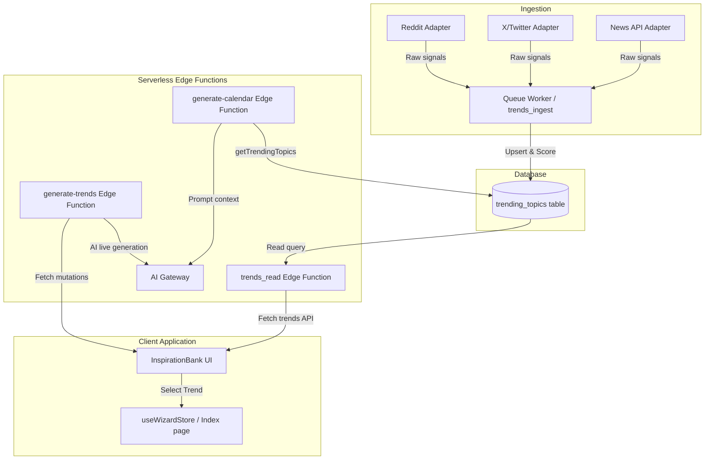

# Design Document: Wave 1 — Advanced Trend-Driven Content Generation

## 1. Overview & Objectives
The goal of Wave 1: Advanced Trend-Driven Content Generation is to shift from static mock trending topics to a dynamic, database-backed trend ecosystem. Creators will receive real-time, high-engagement trending topics tailored to their industry and platform, which are then seamlessly incorporated into their weekly calendar generation.

### Key Objectives
* **Dynamic Ingestion**: Aggregate and ingest hot topics from external sources (X, Reddit, News API) via specialized adapters.
* **Smart Deduplication & Scoring**: Deduplicate incoming signals using normalized tokenized terms and rank them using a recency-decayed popularity score.
* **Unified API Client**: Provide secure endpoints to read trends and request AI-generated topics.
* **Prompt Enrichment**: Automatically weave active trends into AI calendar and post generation prompts.
* **Robust Security**: Implement Row-Level Security (RLS) policies on the trends tables to enforce least-privilege access.
* **Graceful Fallbacks**: Ensure calendar generation degrades gracefully to user brief contexts if the trends database or AI lookup fails.

---

## 2. System Architecture & Data Flows



---

## 3. Database Schema & RLS Policies (Least Privilege)

### 3.1. Schema Relocation & Verification
The schema is currently defined in `migrations/0001_create_trending_topics_table.sql`. To make it a standard part of the Supabase CLI workflow, this migration must be relocated to the `supabase/migrations/` directory with a timestamped prefix, for example: `supabase/migrations/20260707040000_create_trending_topics_table.sql`.

### 3.2. Enabling RLS & Granting Access
By default, public tables in Supabase are accessible via the Data REST API if permissions are granted. We must secure `trending_topics` using Row-Level Security (RLS) to prevent unauthorized writes while allowing read-only access to users.

#### Least-Privilege RLS Rules:
1. **SELECT (Read)**: Accessible to `authenticated` and `anon` roles so the frontend can query trends if needed.
2. **INSERT/UPDATE/DELETE (Write)**: Denied to `authenticated` and `anon` roles. Only the `service_role` (bypassing RLS) can write. If admin users need write access, define an explicit policy check.

#### SQL Implementation Plan:
```sql
-- Enable Row Level Security
ALTER TABLE public.trending_topics ENABLE ROW LEVEL SECURITY;

-- Policy: Anyone can view trending topics
CREATE POLICY \"Allow public read access to trending topics\"
  ON public.trending_topics
  FOR SELECT
  TO anon, authenticated
  USING (true);

-- Policy: Only service_role can modify data (inherent in Supabase, but explicit for admin check if roles are used)
-- No INSERT/UPDATE/DELETE policies are created for public users, meaning they are blocked by default.
```

---

## 4. Ingestion, Deduplication, & Scoring Pipeline

### 4.1. Deduplication Strategy
To avoid feed spam, trends must be deduplicated:
* **Tokenization**: Stem words, lowercase text, strip punctuation, and filter out common stopwords.
* **Hash Generation**: Generate a `dedupe_hash` using a hash function (e.g., MD5/SHA256) of the sorted, normalized terms.
* **Upsert Conflict**: When a duplicate hash is encountered:
  * Merge the `metadata` JSONB.
  * Increment the `signal_count`.
  * Update `last_seen` to `now()`.
  * Recalculate the `score`.

### 4.2. Scoring Formula
The score represents popularity decayed by time. Calculated in the queue worker:
$$\\text{Score} = (\\text{Base Source Weight}) \\times \\log(\\text{signal\\_count} + 1) \\times e^{-\\lambda (\\text{now} - \\text{last\\_seen})}$$
Where:
* **Base Source Weight**: e.g., X = 2.0, Reddit = 1.0, News = 0.5.
* **$\\lambda$ (Decay Constant)**: Decays older topics so fresh trends bubble to the top.

---

## 5. Edge Function Integrations & Configuration

### 5.1. Supabase config.toml Updates
We must declare the functions and set `verify_jwt = false` where appropriate:
```toml
[functions.trends_read]
verify_jwt = false  # Handled via internal rate limiting by IP inside the function

[functions.trends_ingest]
verify_jwt = true   # Requires authenticated admin or service key

[functions.generate-trends]
verify_jwt = false  # Manually authenticates JWT via Bearer token to authorize user-tier quotas
```

### 5.2. Environment Secrets
Ensure the following secrets are configured in the Supabase Dashboard:
* `LOVABLE_API_KEY`: For AI trend generation.
* `NEWSAPI_KEY`: For news adapter.
* `X_BEARER_TOKEN`: For Twitter/X adapter.

---

## 6. Prompt Integration & Graceful AI Fallbacks

### 6.1. Trend Retrieval & Prompt Construction
The `generate-calendar` Edge Function imports `getTrendingTopics` from `_shared/promptHelpers.ts`.
* It fetches the top 5 trending topics matching the user's selected `industry` and `platform`.
* It appends them to the system prompt context:
  `Trending right now in {industry}: {topic1}, {topic2}... Where it fits naturally, weave in a relevant trending angle — but never let a trend override or dilute the core idea.`

### 6.2. Graceful Fallbacks (Crucial Rule)
AI features must fail gracefully. If the database query to `trending_topics` fails:
1. Log a warning internally.
2. Return an empty array `[]` from `getTrendingTopics`.
3. The prompt builder skips the trend injection block.
4. Calendar generation proceeds normally using only the user's campaign brief and core ideas.
5. No user-visible crash occurs.

---

## 7. Step-by-Step Implementation Plan for Builders

### Step 1: Database Migration
* Create a new migration file: `supabase/migrations/20260707040000_create_trending_topics_table.sql`.
* Move the table definition from `migrations/0001_create_trending_topics_table.sql`.
* Append the SQL commands to enable RLS and create the `FOR SELECT` policy.
* Apply using the CLI: `supabase db push --local` or run in the production Supabase console.

### Step 2: Edge Function Configuration
* Add `[functions.trends_read]` to `supabase/config.toml` with `verify_jwt = false`.
* Set Deno/Supabase secrets for the adapters.

### Step 3: Implement Ingestion Queue & Adapters
* Wire the adapters (`news.ts`, `reddit.ts`, `x.ts`) into the `queue-worker` (or a dedicated `trends_ingest` function).
* Write the deduplication hashing and scoring calculation logic.
* Setup pg_cron job in Supabase to trigger the ingestion worker hourly.

### Step 4: Frontend API Client Setup
* Create `src/lib/trendsApi.ts` to manage REST API requests:
  * `getTrends(industry, platform, page, limit)` calling `/functions/v1/trends_read`.
* Update `useGenerateTrendsMutation` in `src/hooks/queries/useRepurposeQueries.ts` to fetch from the live edge function fallback rather than the static array.

### Step 5: UI Connection & Testing
* Connect `InspirationBank.tsx` to read from the API client.
* Add verification tests to confirm RLS policies block unauthorized writes, while public clients can read paginated records successfully.
