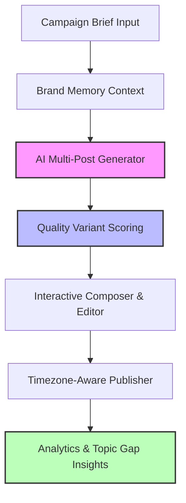

# ⚡ Social Spark (ContentForge): Product One-Pager

## 🚀 Executive Summary
Social Spark (internally known as **ContentForge**) is an AI-powered content calendar generator and scheduling platform designed for creators, marketing teams, and social agencies. Social Spark turns **a single campaign brief into a week of polished, platform-native social media posts** for LinkedIn, X (Twitter), Instagram, Facebook, newsletters, and blogs—all while persisting a unified brand voice and optimizing each post for specific channel formats.

---

## ⚠️ The Problem
Content teams and social media managers struggle with:
* **Creation Inertia**: Staring at a blank screen trying to generate fresh ideas every day.
* **Platform Inconsistency**: Repurposing the exact same text across LinkedIn, X, and newsletters, resulting in poor engagement due to layout, tone, or character limit mismatches.
* **Draft Loss**: Standard wizard interfaces lose user inputs on accidental refreshes or network drops.
* **Analytics Black Box**: Creating content blindly without knowing which hooks, CTAs, or formats perform best.

---

## 💡 The Solution: Social Spark
Social Spark streamlines social media management through six integrated workflows:



1. **Brand Memory Database**: Persists custom brand styles, specific voices, audience targets, goals, forbidden terms, and hashtag policies across generation cycles.
2. **AI Calendar Wizard**: Automatically produces a full week's worth of posts tailored to multiple channels based on a single brief.
3. **Quality Variant Scoring**: Generates variations of draft posts, scoring them in real-time on hook strength, CTA effectiveness, and readability.
4. **Draft Auto-Recovery**: Autosaves the state of the creation wizard locally and remotely so a browser refresh or crash never resets your progress.
5. **Multi-Channel Repurposing**: Easily transforms a successful post from one channel layout into another using specialized platform guides.
6. **Topic Gap Detection**: Calendar listings automatically identify and highlight missing content categories or themes to keep feeds balanced.

---

## 🛠️ Technical Architecture

### Tech Stack
* **Frontend**: React 18 + TypeScript + Vite (with fast incremental builds).
* **Styling**: Tailwind CSS + shadcn/ui custom design system tokens.
* **State Management**: TanStack Query (React Query) for server state caching, Zustand (`useWizardStore.ts`) for centralized wizard state.
* **Backend**: Supabase (PostgreSQL, Auth, Storage, Edge Functions).
* **Edge Functions**: Deployable serverless services (calendar/post generation, image generation, adapters, telemetry, trend ingestion).

### Database Schema Core
The database is backed by Supabase PostgreSQL and is segmented into:
1. **User Profiles**: User preferences and rate-limit counters.
2. **Calendars & Posts**: Schema representing post content, locked days, publication statuses, and schedules.
3. **Brand Memory**: Custom brand settings and templates.
4. **Analytics & Logs**: System telemetry, click/view metrics, and audit tables.

---

## 📊 Feature Breakdown

| Feature | Description | Business Value |
| :--- | :--- | :--- |
| **🤖 Brand Memory** | Guide presets that dictate tone, vocabulary, and platform character limits. | Ensures 100% brand consistency. |
| **🔄 Post Repurposing** | Instantly change a post's platform target (e.g. LinkedIn 3000 chars to X 280 chars). | 10x faster cross-posting velocity. |
| **🎨 Image Generator** | Create custom cover images using AI directly inside the editor. | Self-contained asset pipeline. |
| **⏳ Auto-Recovery** | Background draft saving to IndexedDB / cloud storage. | Eliminates data-loss frustration. |
| **🔍 Topic Gap Detection** | Dynamic badges pointing out topics that have been underrepresented in recent weeks. | Maintains a balanced, high-converting content mix. |
| **📊 Quality Scoring** | Advanced evaluation cards assessing hook quality, CTAs, and overall readability. | Higher CTR and engagement rates. |

---

## 📈 Key Success Metrics

* **Time-to-Schedule**: Target **30% reduction** in scheduling workflows for power users.
* **Conversion Target**: Aiming for **15% free-to-paid subscriber conversion** via premium analytics, repurposing tools, and custom brand slots.
* **Flow Satisfaction**: Reaching a Target Net Promoter Score (**NPS**) of **40+** for the calendar creation wizard.

---

## 📅 Roadmap & Milestones

> [!NOTE]
> We have completed development on core authentication, calendar editors, the Zustand wizard store, mock testing setups, and timezone-aware schedule views.

```mermaid
timeline
    title Social Spark Roadmap
    section Completed : Foundations
        : Supabase DB & Auth setup
        : useWizardStore central state
        : Calendar and post editors
    section Current Phase : Refinement
        : Wave 1: Security & correctness RLS
        : Wave 2: UX and design system polish
        : Wave 3: State & function hardening
    section Future Work : AI & Ingestion
        : Platform-native analytics integrations
        : Advanced trend ingestion pipeline
        : Team co-authoring & approval roles
```
