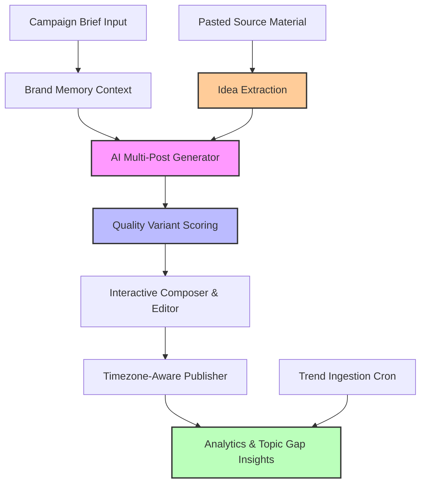

# ⚡ Social Spark (ContentForge): Product One-Pager

## 🚀 Executive Summary
Social Spark (internally known as **ContentForge**) is an AI-powered content calendar generator and scheduling platform designed for creators, marketing teams, and social agencies. Social Spark turns **a single campaign brief into a week of polished, platform-native social media posts** for LinkedIn, X (Twitter), Instagram, Facebook, newsletters, and blogs—all while persisting a unified brand voice and optimizing each post for specific channel formats.

---

## ⚠️ The Problem
Content teams and social media managers struggle with:
* **Creation Inertia**: Staring at a blank screen trying to generate fresh ideas every day.
* **Platform Inconsistency**: Repurposing the exact same text across LinkedIn, X, and newsletters, resulting in poor engagement due to layout, tone, or character limit mismatches.
* **Draft Loss**: Standard wizard interfaces lose user inputs on accidental refreshes or network drops.
* **Analytics Black Box**: Creating content blindly without knowing which hooks, CTAs, or formats perform best.

---

## 💡 The Solution: Social Spark
Social Spark streamlines social media management through eight integrated workflows:



1. **Brand Memory Database**: Persists custom brand styles, specific voices, audience targets, goals, forbidden terms, and hashtag policies across generation cycles.
2. **AI Calendar Wizard**: Automatically produces a full week's worth of posts tailored to multiple channels based on a single brief.
3. **Quality Variant Scoring**: Generates variations of draft posts, scoring them in real-time on hook strength, CTA effectiveness, and readability.
4. **Draft Auto-Recovery**: Autosaves the state of the creation wizard locally (Zustand `persist`) and remotely so a browser refresh or crash never resets your progress.
5. **Multi-Channel Repurposing**: Easily transforms a successful post from one channel layout into another using specialized platform guides.
6. **Topic Gap Detection**: Calendar listings automatically identify and highlight missing content categories or themes to keep feeds balanced.
7. **Source-to-Post Repurposing**: Paste any long-form source (up to 20,000 characters) and the extractor returns 3–10 distinct, format-tagged post angles, each expandable into a full platform-ready post with one click.
8. **Trend Ingestion Pipeline**: A scheduled cron job ingests platform trend data into a dedicated `trends` table, surfaced back through a read API to inform what to create next.

---

## 🛠️ Technical Architecture

### Tech Stack
* **Frontend**: React 18 + TypeScript + Vite (with fast incremental builds).
* **Styling**: Tailwind CSS + shadcn/ui custom design system tokens.
* **State Management**: TanStack Query (React Query) for server state caching, Zustand (`useWizardStore.ts`, now with `persist` for offline draft recovery) for centralized wizard state.
* **Backend**: Supabase (PostgreSQL, Auth, Storage, Edge Functions).
* **Edge Functions**: Calendar/post generation, image generation, idea extraction (`extract-ideas`), repurposing, trend ingestion (`trends-ingest`, `trends-read`), inline rewrite, adapters, telemetry.
* **Agent Access**: An MCP server (`supabase/functions/mcp`) with OAuth 2.1 consent flow lets external AI agents connect to a user's workspace under explicit, scoped authorization.

### Database Schema Core
The database is backed by Supabase PostgreSQL and is segmented into:
1. **User Profiles**: User preferences and rate-limit counters.
2. **Calendars & Posts**: Schema representing post content, locked days, publication statuses, and schedules.
3. **Brand Memory**: Custom brand settings and templates.
4. **Analytics & Logs**: System telemetry, click/view metrics, and audit tables.

---

## 📊 Feature Breakdown

| Feature | Description | Business Value |
| :--- | :--- | :--- |
| **🤖 Brand Memory** | Guide presets that dictate tone, vocabulary, and platform character limits. | Ensures 100% brand consistency. |
| **🔄 Post Repurposing** | Instantly change a post's platform target (e.g. LinkedIn 3000 chars to X 280 chars). | 10x faster cross-posting velocity. |
| **🎨 Image Generator** | Create custom cover images using AI directly inside the editor. | Self-contained asset pipeline. |
| **⏳ Auto-Recovery** | Background draft saving to local storage (Zustand `persist`) and cloud (`wizard_drafts`). | Eliminates data-loss frustration, including offline refreshes. |
| **🔍 Topic Gap Detection** | Dynamic badges pointing out topics that have been underrepresented in recent weeks. | Maintains a balanced, high-converting content mix. |
| **📊 Quality Scoring** | Advanced evaluation cards assessing hook quality, CTAs, and overall readability. | Higher CTR and engagement rates. |
| **✂️ Source-to-Post** | Paste long-form material in, get N distinct format-tagged post ideas out, each one-click generated into a full post. | Turns existing content (transcripts, articles, notes) into a week of posts without a blank page. |
| **📡 Trend Ingestion** | Scheduled cron pipeline pulls platform trend data into Supabase, exposed via a read API. | Keeps content suggestions grounded in what's actually trending. |
| **🔌 MCP + OAuth Consent** | External AI agents can request scoped, user-approved access to a workspace via MCP. | Opens Social Spark up as a tool other AI systems can drive on the user's behalf. |

---

## 📈 Key Success Metrics

* **Time-to-Schedule**: Target **30% reduction** in scheduling workflows for power users.
* **Conversion Target**: Aiming for **15% free-to-paid subscriber conversion** via premium analytics, repurposing tools, and custom brand slots.
* **Flow Satisfaction**: Reaching a Target Net Promoter Score (**NPS**) of **40+** for the calendar creation wizard.

---

## 📅 Roadmap & Milestones

> [!NOTE]
> A full-app audit on 2026-07-07 scored the product **6.4 / 10** and found 4 P0 release blockers (RLS `WITH CHECK` gaps, a quota-bypass path on several edge functions, missing image-generation ownership checks, and over-broad `admin_users` grants). All four are now remediated in `docs/AUDIT_REMEDIATION_RUNBOOK.md`, alongside the full P1–P3 backlog (stable OAuth redirects, offline wizard persistence, log sanitization, scoring heuristics, CORS centralization, chunk splitting, and more). Source-to-post repurposing and the trend ingestion pipeline, both previously "Future Work," have since shipped. As of 2026-07-08 the runbook's deferred quota-gating tests are written, Chromium e2e (including all 4 accessibility scans) runs clean, and a design-system pass replaced the template-generated visual language (decorative gradients/glows/glassmorphism, oversized radii, colored button shadows) with a flatter, restrained "refined editorial" treatment across the app. Supabase RLS/pgTAP regression tests remain written but unexecuted locally — no Docker daemon in this environment; run in CI or on a dev machine with Docker before release.

```mermaid
timeline
    title Social Spark Roadmap
    section Completed : Foundations
        : Supabase DB & Auth setup
        : useWizardStore central state
        : Calendar and post editors
    section Completed : Security Hardening (2026-07-07 audit)
        : RLS WITH CHECK gaps closed (F-001)
        : Quota-bypass paths closed on repurpose/rewrite/trends/image functions (F-002)
        : Image-gen ownership enforcement (F-004)
        : admin_users grants revoked from authenticated (F-005)
    section Completed : AI & Ingestion
        : Source-to-post repurposing (extract-ideas + Repurpose page)
        : Trend ingestion pipeline (trends-ingest / trends-read)
        : MCP server with OAuth 2.1 consent for external agents
    section Completed : Refinement (2026-07-08)
        : P2/P3 audit backlog — scoring heuristics, CORS centralization, chunk splitting
        : Deferred F-002 quota-gating tests written (16 tests, 4 endpoints)
        : Chromium e2e + accessibility scans run clean (33/33), 4 contrast bugs fixed
        : Design system refresh — de-templated visual language app-wide
    section Future Work : Growth
        : Platform-native analytics integrations
        : Team co-authoring & approval roles
```
